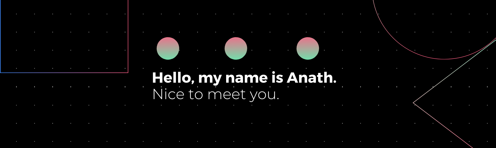

  <h1>👋</h1>
  
A Project Manager and Frontend Developer

 

---

## 🚀 About Me

I'm a passionate and results-driven professional with a unique blend of experience in <strong>Software Engineering</strong> and <strong>Project Management</strong>. After a fulfilling period steering projects and leading teams, I'm enthusiastically returning to my roots in development, specifically focusing on becoming a proficient <strong>Frontend Developer</strong>.

True engineering excellence lies in building not just beautiful interfaces but also highly functional, performant, and maintainable web applications. My background in project management has instilled in me a strong understanding of product lifecycle, team collaboration, and delivering impactful solutions, which I now bring to my development work.

Currently, my goal is to leverage my renewed coding and professional skills to contribute as a Frontend Developer within my current company, focusing on innovative and user-centric web solutions.

### Why Frontend?

The immediate visual feedback, the intricate dance between design and code, and the direct impact on user interaction are what truly captivate me about frontend development. I thrive on the challenge of transforming complex ideas into seamless and delightful digital experiences.

 

---

## 🎯 My Current Focus

My learning and project efforts are intensely concentrated on modern frontend technologies, particularly:

<ul>
  <li>⚛️ <strong>React.js:</strong> Building dynamic and efficient user interfaces.</li>
  <li>➡️ <strong>Next.js:</strong> Developing powerful, production-ready React applications with server-side rendering and static site generation capabilities.</li>
  <li>📏 <strong>TypeScript:</strong> Enhancing code quality, scalability, and maintainability through strong typing.</li>
  <li>✨ <strong>Clean Code & Best Practices:</strong> Writing readable, reusable, and testable code.</li>
  <li>🌐 <strong>Responsive Design & Accessibility:</strong> Ensuring web applications are universally accessible and performant across all devices.</li>
</ul>

---

## 🎯 My Skills

  

---

## 🌱 Learning & Growth

I am actively building my skills through:

<ul>
  <li>Hands-on coding, building personal projects, and contributing to open-source initiatives to solidify theoretical knowledge with practical application (desire to start contributing to open source).</li>
  <li>Engaging with the developer community, participating in online forums, and staying updated with the latest industry trends and best practices.</li>
</ul>

 

---

<!--## 💻 Projects

Here are some projects where I'm applying my skills. More coming soon as I progress!

<table width="100%">
  <thead>
    <tr>
      <th width="30%" align="left">Project Name</th>
      <th width="50%" align="left">Description</th>
      <th width="20%" align="left">Technologies</th>
    </tr>
  </thead>
  <tbody>
    <tr>
      <td><a href="[Link to Project 1 Repo]">Project X</a></td>
      <td>A [brief, compelling description of Project X, highlighting its purpose or a key feature]. This project demonstrates my ability to [mention a specific skill like API integration, state management, etc.].</td>
      <td>React, Next.js, TypeScript, [Other Tech]</td>
    </tr>
    <tr>
      <td><a href="[Link to Project 2 Repo]">Portfolio Website V2</a></td>
      <td>My personal portfolio, rebuilt from scratch to showcase my latest frontend development skills and design aesthetic. Focus on performance and responsive design.</td>
      <td>Next.js, TypeScript, Tailwind CSS</td>
    </tr>
    <tr>
      <td><a href="[Link to Project 3 Repo]">[Your Next Project Idea]</a></td>
      <td><i>(Coming Soon)</i> A [brief idea of your next project, e.g., "e-commerce prototype," "data visualisation dashboard"].</td>
      <td>React, [Other Tech]</td>
    </tr>
  </tbody>
</table>
 

  
➡️ Explore more projects in my repositories! ➡️

 

--- -->

## 🤝 Let's Connect!

I'm always open to collaborating on interesting projects, sharing knowledge, and discussing new opportunities, especially those involving Frontend Dev. Let's build something amazing together!

  
  

 

---

## 📈 GitHub Stats

  <!-- -->
 <!--  -->
  

 

---

  <i>"The best way to predict the future is to create it."</i>

